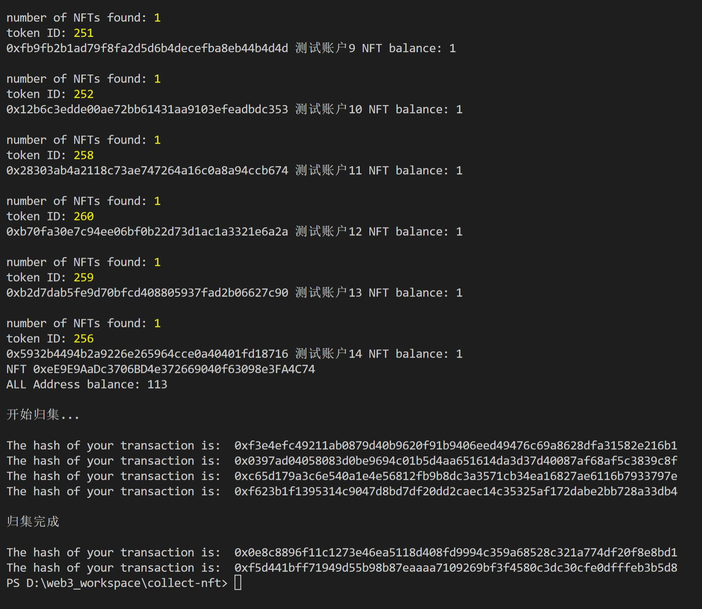
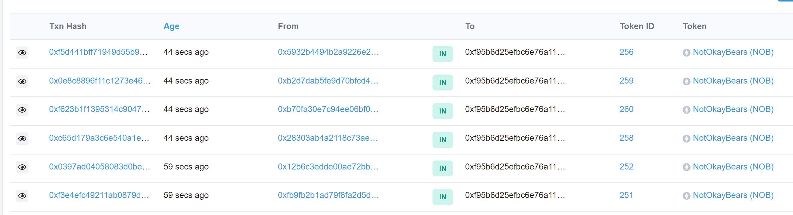

## collect-NFT  
在本地批量归集多个钱包的nft到归集地址  
同时支持按合约查询nft库存  

> 实际测试时发现，对钱包内余额为1的nft归集手续费略低于授权，对钱包内余额超过1的nft归集手续费会成倍增加，并不适用于使用脚本归集。


## 使用方法  

### 配置config.js  
1.`alchemyKey` [注册alchemy](https://alchemy.com/?r=TUwNjExMDY3MzM2M)  

2.`maxPriority` 最大优先费  

3.`maxGasPrice` 最大Gas费  

4.`multipleGas` gaslimit倍数  

5.`collectAddress` 归集地址  

6.`publicKey` 公钥/账户地址
> 数组。["Address1","Address2"]  

7.`privateKey` 私钥  
> 数组。["privateKey1","privateKey2"]  

8.`nickName` 账户别名
> 数组。["nickName1","nickName2"]  

**以上三组数据要一一对应并保持总数一致**  

### 部署流程  

1.克隆或下载该项目到本地  
```
git clone https://github.com/luoyeETH/flipAlertBot.git
```
2.切换到对应目录，安装所需依赖包，同时建议安装forever进程管理模块  
```
npm install
npm install forever -g
```
3.按照[配置文件](#配置configjs)配置config.js内各项参数  

4.运行脚本  
```
# 查询NFT库存  
# ContractAddress合约地址
node index.js <ContractAddress>  

# 批量归集  
# ContractAddress合约地址 accounts归集的账户数(填0全部归集)
node index.js <ContractAddress> <accounts>
```

5.停止脚本
```
Ctrl + C
```

## 运行截图  

运行日志  
  

etherscan  
  